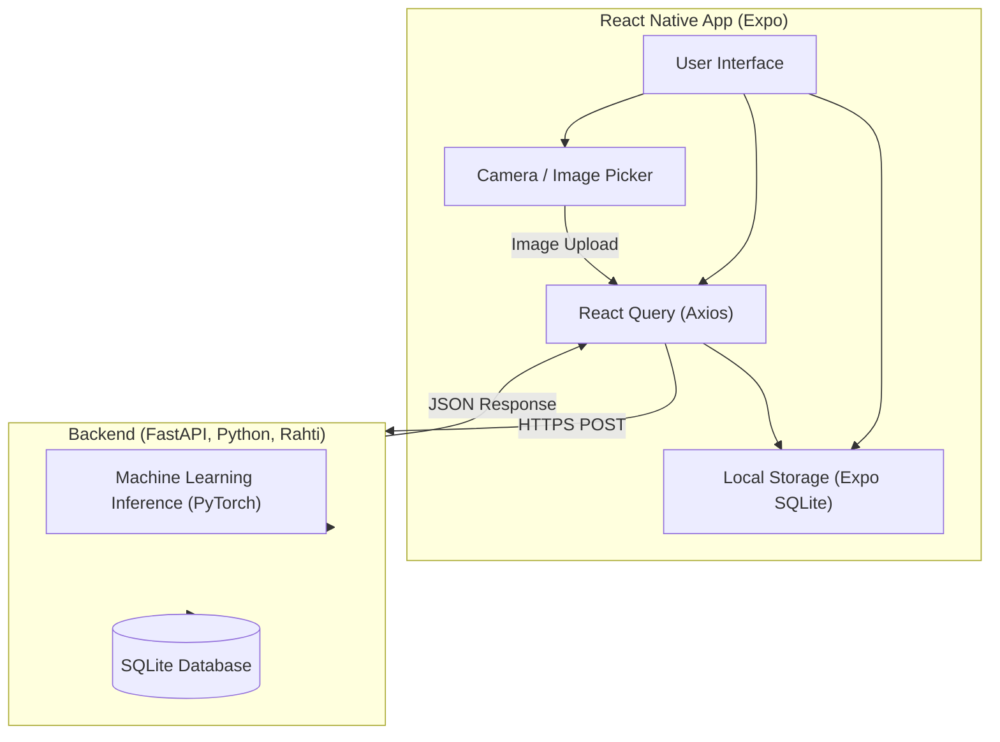

# Käytetyt teknologiat

## Drawer & Stack navigaatio

Halusin käyttää kahta eri navigaatiota, koska sen toteutukseen löytyi kätevästi materiaalia. Lisäksi tein koko ohjelman aluksi pelkästään stack navigaatiolla, mutta etusivu muuttui äkkiä sekavaksi, joten halusin drawerin mukaan ja se toimi todella hyvin.

## WebView

Tämän avulla onnistui upottamaan Alvo Beautyn oman sivuston, about us ja ajanvarauksen, omaan mobiilisovellukseeni. Tämä helpottaa huomattavasti, varsinkin ajanvarauksen osalta.

## Toast

Tietyn mallinen pop-up notifikaatio komponentti, joka näyttää mielyttävältä. Toastit joutui luomaan jokaiseen tarvittavaan screeniin erikseen, vaihtuvan tekstin vuoksi ja tämä vähän pilaa koodin siisteyttä.

## Google Maps API

Rajapinta josta haen yrityksen sijainnin ja mahdollisuuden nappia painamalla siirtyä Google Mapsiin, ohjeita varten.

## Firebase

Googlen palvelin puolen ja sovellus kehitykseen käytetty alusta.

### Authentication

Firebasen käyttäjä autentikointi, huono puoli ettei tue käyttäjätunnuksella kirjautumista.

### Realtime Database

Yksi Firebasen monista tietokanta malleista, tähän pystyy päivittämään tiedot niin että ne ei poistu aina kun sovelluksesta poistuu


````mermaid
sequenceDiagram
    autonumber

    participant User as User
    participant App as React Native App (Expo)
    participant CAM as Camera / Image Picker
    participant API as FastAPI Backend (Rahti)
    participant ML as ML Inference (PyTorch)
    participant DB as SQLite Database

    User->>App: Opens "Add Item" screen
    App->>CAM: Launch camera / image picker
    CAM-->>App: Returns selected image

    App->>API: POST /upload-image\n(multipart/form-data)
    API->>ML: Run inference on image
    ML-->>API: Predicted item result

    API->>DB: Save item + recognition history
    DB-->>API: Confirm save

    API-->>App: JSON response\n(prediction + item data)
    App-->>User: Displays item info\nand stores local history (SQLite)
```
